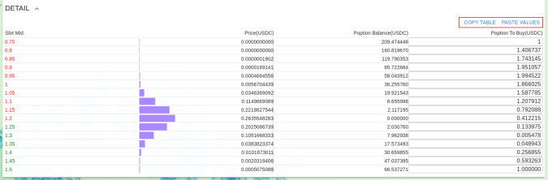
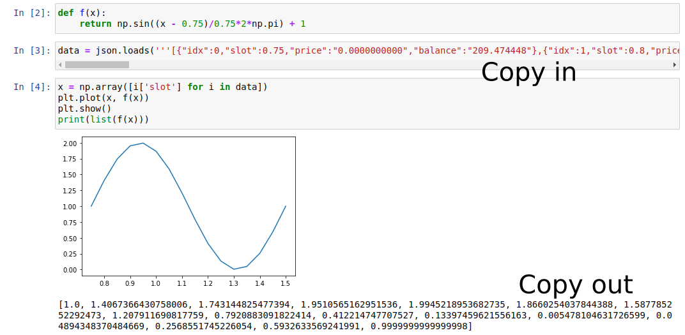
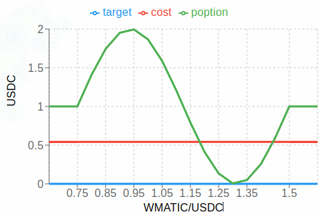
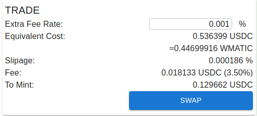

自定义收益函数
======================
我们可以使用一些前端界面已有的小工具来构造一些常见需求的 poption。如果我们的需求没有对应的小工具，我们还可以通过自定义收益函数来构造需要的 poption。我们需要先了解 :ref:`payoff_tokens` 作为基础知识，然后参考下文例子来构建自定义收益的 poption 。

方法
-----------
首先我们要准备一个我们想要的收益函数 :math:`f(x)` ，我们可以在任何地方准备它，比如在 Excel 中，在 Jupyter Notebook 中，这都是可以的。这里我们用 Jupyter Notebook 举例，使用的收益函数是正弦函数。

在Swap界面中，我们点击最下方的Detail，展开这个标签页。在这里有一张表格详述了poption 的各个收益令牌的的情况。点击表格右上方的 COPY TABLE 按钮。我们可以将表格数据以JSON的格式复制到剪贴板上。

将表格中的slot作为x代入到 :math:`f(x)` 中，得到收益函数在各个 slot 点的 y 值，然后将这些值复制回 Detail 表格，我们可以把这些收益函数的 y 值输出成 json 并使用 PASTE VALUE 按钮快速做到这一点。
整个流程如下图所示。

然后我们就可以在收益图表和交易界面中看到收益曲线和交易相关信息：

