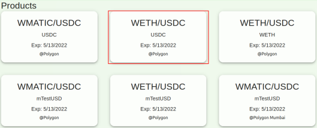
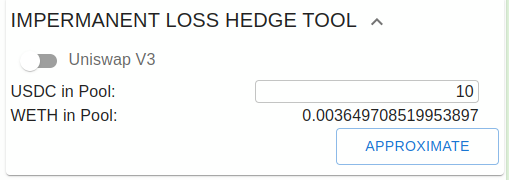
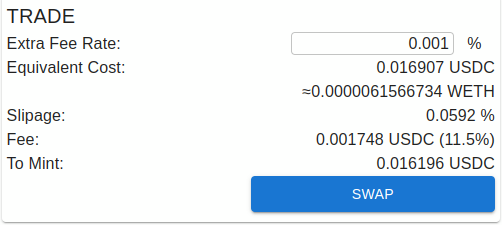
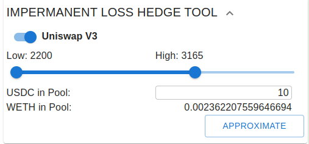
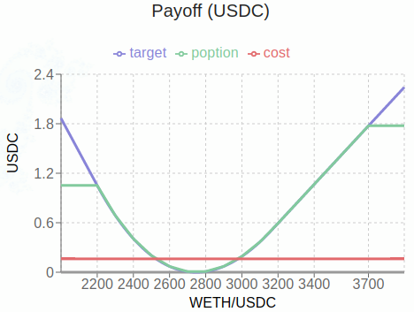
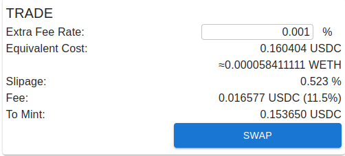

对冲无常损失
=====================

本文将介绍如何利用 poption 对冲无常损失。在金融市场中，利用衍生品转移风险是常见的做法。当资产价值随某一价格波动产生变化的时候，我们可以购买和这一变化相反收益曲线的衍生品来对冲变化带来的不确定性，规避损失。由于衍生品往往是高资金效率的，持有这样的衍生品往往之占一小部分资金。

操作
-----
Uniswap v2 或类似流动性池
~~~~~~~~~~~~~~~~~~~~~~~~~

现在我们看一个具体的例子。假设我们要对冲的是 ETH-USDC 流动性池中无常损失。 我们在app页面选择 WETH/USDC-USDC的poption并点击。如图所示：

在 poption 前端界面中我们有一系列的小工具用于快速生成各种需求下的 poption。右边第二个小工具是无常损失对冲工具。它能自动计算流动性池中的无常损失并给出对冲方案，具体的计算方法可以参考 :ref:`il_math` 。

如果我们需要对冲 Uniswap v2 或类似流动性池。我们直接在USDC 的输入框中输入流动性池中的USDC资产数量就可以了，WETH的资产数量小工具会根据当前价格自动给出。

点击APPROXIMATE，我们就可以生成一个能够对冲无常损失的poption。我们可以在左侧的收益图中查看这个poption。图中的蓝线是需要对冲的无常损失，绿线是能够买到的poption，红色是需要付出的成本。在一个很大的范围中绿线和蓝线是紧密贴合的。在价格发生剧烈变化的时候，为了防范清算风险，poption不会提供完全的对冲，只能提供部分对冲，因此在图表两侧，绿线停止上升，和蓝线产生差异。关于这部分的解释可以参考 :ref:`leverage` 。

.. image:: ../images/il_v2_payoff.png
    :align: center

然后我们在右侧的TRADE 工具中可以看到这个poption的报价，可以看到相对于流动性池中的资产来说，poption的成本并不高，（约为池中资产的0.085%）。参考 :ref:`trade_tool` 获取报价和费用的更多信息。

Uniswap v3 流动性池
~~~~~~~~~~~~~~~~~~~~~~~~~
我们也可以对冲 Uniswap v3 中的无常损失。在小工具中打开 Uniswap v3 选项，选择价格范围，输入流动性池中的USDC数量，WETH的资产数量小工具会根据当前价格自动给出。

点击APPROXIMATE，我们就可以生成一个能够对冲无常损失的poption。我们可以看到图像虽然和v2 的长的差不多，但是左侧的y坐标轴标尺变大了。这是因为 uniswap v3 有更高的资本效率。同样的资产放入池中会引起更高的无常损失。（但同时也能获得更高的收益。）

然后我们在右侧的TRADE 工具中可以看到这个poption的报价，由于对冲了更多的风险，对冲v3 无常损失的poption会比 v2 情况下的成本更高，但相对来说，仍然是便宜的（约为池中资产的0.8%）：

讨论
-----

在DeFi生态中，不只有poption能提供可以对冲无常损失，也有其他的产品提供类似的服务，那poption和他们之间有什么区别呢？

首先 poption 是一个通用的衍生品产品。用它来对冲损失是直接的简单的，不需要通过合成多种金融产品来实现对冲功能。此外它的通用性决定了它在售出一个对冲产品的同时也售出它的反面，当poption自动做市商将一个对冲无常损失的poption定价过高的时候，投机者可以通过做空这样的poption来获益。这样对于有对冲需求的投资者有两个好处。

#. 对冲无常损失的poption价格必须是公允的，流动性池必须给出正确的poption 定价否则投机者可以通过购买相反payoff的poption套利。单方面的估价往往会因利益关系导致错误定价，比如造成2007年金融危机的次级贷的错误估价就是如此。在poption中任何人都可以沽多或沽空任意的收益曲线，买和卖是完全对称的，定价最终由市场完成，这将有效的保护市场和买家。

#. 通过市场价格信号，当对冲无常损失的产品有较高需求的时候，我们能从投机者那里获取用于对冲损失的资产而不是仅仅依靠流动性提供这来提供这些资产，这有助于稳定资产价格。

其次在市场中有一些对冲无常损失的产品是有非常严重的兑付风险的。而在 poption 中是没有此类风险的，它的收益在到期后是必然能够兑现的。

总结
----

在 Poption 市场中对冲一个无常损失是方便容易的。Poption的通用性和安全性会使在Poption市场中对冲无常损失变得有吸引力。
