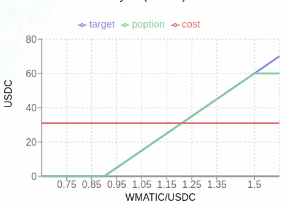
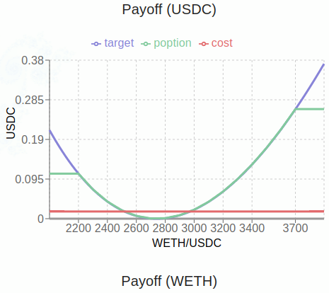

简介
=========

poption 的名字来源于 payoff option （收益曲线期权）和 pop option （大众期权）。如同它的名字所表示的那样，它是一种以收益曲线为基础的期权。一个金融产品是非常核心的属性就是它的收益曲线，收益曲线相似的金融产品可以满足相似的金融需求。poption 是一种在收益曲线上提供最大自由度，而在其他方面则做最大简化的金融衍生品。这使得它能够满足不同的金融需求却又足够简单从而能大众化。我们相信它在未来能成为链上主要的金融衍生品。

同其他金融衍生品先定义衍生品所代表的权益再推导其收益，投资人通过组合不同的产品来获得自己想要的收益曲线不同。在 poption 中投资者可以直接自定义收益曲线并从做市商那里获得相应收益曲线的 poption，并在 poption 到期时获得收益曲线规定的底层资产。下图是自定义 poption 曲线的几个例子，绿线是poption自定义的收益曲线。

    :ref:`一个基于 Matic 价格采取牛市价差策略收益的 poption ，收益以 USDC 结算。<leverage>`

    :ref:`一个提供对冲ETH-USDC 流动性池无常损失功能的 poption，收益以 USDC 结算<il_hedge_example>`

.. figure:: ../images/any_payoff_chart.png
    :align: center

    :ref:`一个为了好玩定义正弦函数为收益的 poption，收益以 USDC 结算<sin_payoff>`

接下来你可以阅读以下链接了解更多信息：

.. toctree::
   :maxdepth: 1

   leverage
   hedge_il
   any_payoff
   poption_contract
   settle
