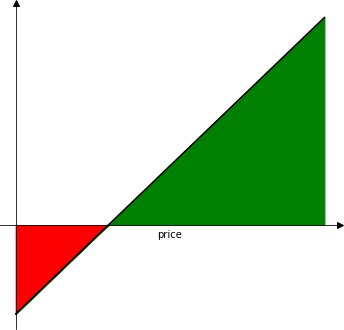
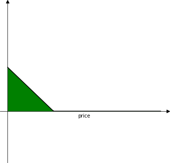
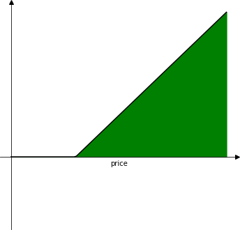
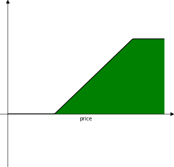
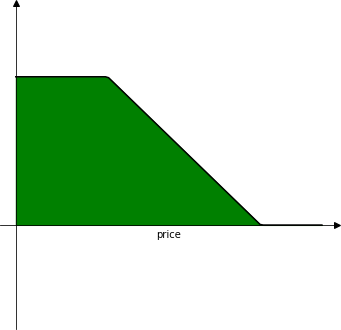
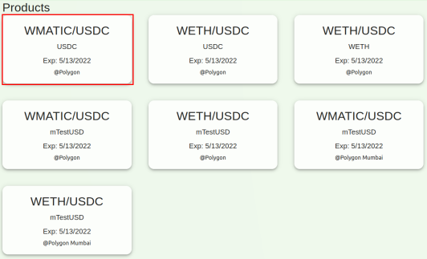
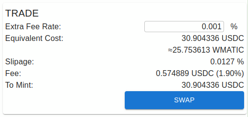

杠杆交易
=====================

本文将介绍如何利用 poption 进行杠杆交易。使用 poption 进行杠杆交易比保证金更加的安全。对于了解期权交易的读者来说在 poption 中使用牛熊价差策略就是最基本的杠杆交易方法。对于不熟悉的读者来说本文将头开始介绍。我们可以从中了解如何使用 poption 完成杠杆交易，并对风险转移产生一定的概念。

.. _leverage:

方法
----

我们从最简单的保证金交易开始理解 poption 中的杠杆交易。在保证金交易中我们从券商借入一笔资金，使用这笔资金加上自己的资金购入一些资产。然后随着资产价格的变动我们会获得更高的收益或者承受更高的亏损。它的收益曲线是这样的。

我们看到这个收益曲线中有负的一部分，这是因为当资产价格下跌后我们持有的资产的价值就会低于借入的资金价值。这个时候我们就没法还清全部的借款了，券商可不希望这样，他要确保自己能收到还款。因此此时我们就会收到追缴保证金通知或者更进一步的，被清仓。但其实我们并不希望欠券商钱或者被强制交易不是么？那么我们应该把这部分风险转移出去。我们可以通过购买看空期权来做到这一点。看空期权的收益曲线长这样。

组合后我们的资产的收益曲线长这样。

看，现在收益曲线中没有负数的部分了，不管价格怎么变，我们都不会欠券商钱，因为我们不会欠券商钱，券商也不能给我们清仓，强迫我们交易。可以看到通过一个看空期权，我们把风险转移到了期权卖家手中。此外由于这样的看空期权是一个价外期权，它会很便宜。由此得出，这里我们牺牲了一点点的资金效率的情况下利用衍生品使交易变得更安全。在 poption 中我们可以直接购买一个对应收益的 poption 来满足相同的金融需求。但和传统期权有一点不一样的地方，在 poption 中做市商和投资者的位置是完全对称的，做市商保护自己不被清算的需求和普通投资者是一样的，资产价格的持续上涨会导致裸空的期权卖家承受被挤兑的风险，为了回避这部分风险，做市商不会向投资者卖出这部分期权。最后可以被交易的 poption 的收益曲线长这个样子。这相当于传统期权中的一个牛市价差策略。

当投资人想要做空资产价格的时候，他也可以使用一个相反的策略，也就是熊市价差策略，收益曲线如下。

.. _leverage_example:

操作
--------------------

现在我们看一个具体的例子。

假设当前 MATIC 兑 USDC 的比例是 1.2:1，我们看涨 MATIC，我们希望在 poption 中以 4 倍杠杆做多 MATIC。我们在app页面选择 WMATIC/USDC-USDC的poption并点击。如图所示：

在 poption 前端界面中我们有一系列的小工具用于快速生成各种需求下的 poption。右边第一个小工具是期权工具。它能计算各种行权价下的期权的收益并生成一个近似的 poption，我们在这个工具中也集成了近似保证金交易的功能。

在工具中我们选择 ‘call’表示我们希望做多，然后点击 ‘X4’ 表示四倍杠杆。在 share 栏输入 100 表示购买 100 个 MATIC 份额的 poption。然后点击 Approximate。如下图所示：

.. image:: ../images/lev_0.png
    :align: center

在左侧的收益图表中绿线是我们所要购买的
poption 收益曲线，红线是我们需要支付的成本。当价格为 0.9 的时候 Poption 的收益是 0，当价格是 1.5 的时候它的收益是 60 USDC。Matic 价格上涨了 0.6 而 Poption 的收益上升了 60，说明它的确和 100 个 Matic 在这个区间上有相同的盈亏。当我们使用 4 倍杠杆的时候，我们的清仓线在 0.9，这也和收益曲线是一致的。如下图所示：

.. image:: ../images/payoff_l_5.png
    :align: center

最后我们看一下报价，在右下方的 TRADE 工具中，这样一个 poption 的报价是 30.9 USDC，这略多于 1.2 / 4 \* 100 = 30 USDC，这一部分来自对冲清算风险所付出的价值，一部分是因为 poption 市场本身估值和现货市场不完全一致，还有一部份是交易费用和滑点损失。但总体来说这是一个带有四倍杠杆的衍生品。
最后我们在 TRADE 工具中点击 SWAP 我们就可以购买这个 Poption 了。

我们可以选择支付底层资产或同样的poption 收益去完成这次交易，App会优先使用投资者账户中的poption，如果poption不足，投资者则需要支付相应的底层资产。在这个例子中，账户内并没有poption， 所以这次交易全部使用USDC支付，这显示在最下方的To Mint信息中，To Mint的价值等于等价成本。请参考 :ref:`trade_tool` 了解更多相关信息。

讨论
-----

在传统金融市场中，利用资金优势或者信息优势，通过控制市场中的流动性恶意轧压对手的情况比比皆是。在过去的一年中，就有 GME 事件，原油宝事件，伦敦镍事件发生。可见清算风险即便是专业人士也很难防范，并且这些事件严重破坏了金融市场的安全和稳定。这是我们在设计 poption 之初就想避免的。我们不希望我们市场中的交易者因为清算的压力而被迫去做自己并不愿做的交易。我们希望每一笔交易都来自市场的真实需求和对标的物价值的认真评估。此外这也帮助我们将自动做市商设计得更简单。由于有限的算力，在链上评估清算风险会非常困难，如果存在这样的风险自动做市商在一些情况下会给出错误的报价，从而造成流动性池中的资金损失。这也是我们不愿看到的。

总结
----

在 Poption 市场中任何人都无法买入或卖出一份有清算风险的衍生品。Poption 在排除了清算风险的同时最大地保留了衍生品的高资金效率。我们认为相较于传统保证金交易。Poption 是更安全，更有吸引力的金融衍生品。
