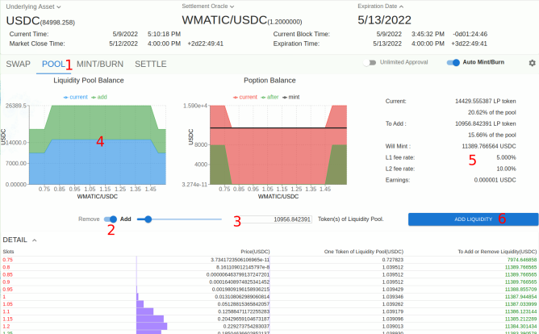
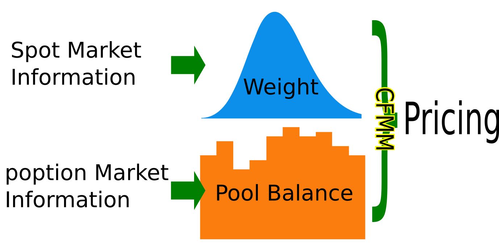

提供流动性
===================================

对于每一个 poption 智能合约，我们配套了一个自动做市商合约来满足交易功能。

与自动做市商交换poption
-------------------------
在 poption 中，一个投资者持有的 poption 资产是以 :ref:`收益令牌<payoff_tokens>` 的形式储存在智能合约中的。poption 自动做市商是一个多令牌的变权重的自动做市商。它能够实现一个poption合约中多种令牌之间的交换，从而满足交易不同poption 的需求。

我们的自动做市商是一个常函数做市商，它使用的交易函数如下，其中 :math:`\mathbf{w}` 是收益令牌的权重向量， :math:`\mathbf{a}` 是流动性池中收益令牌的结余向量：

.. math::
    \phi(\mathbf{w},\mathbf{a})=\sum_{i=1}^n w_ilog(a_i)

它等价于几何平均数交易函数：

.. math::
    exp(\phi'(\mathbf{w},\mathbf{a}))=\prod_{i=1}^n a_i^{w_i}

流动性池令牌
-----------------------------
同很多自动做市商的流动性池一样。poption的流动性池也是同比进出的。进入流动性池的收益令牌必须和流动性池中已有的收益令牌保持相同的比例。进入流动性池会铸造相应的流动性池令牌，离开流动性池则会销毁这些令牌。

前端界面
-----------
我们可以在 poption 界面中向流动性池添加或移出流动性。我们在 `poption App页面 <https://www.poption.exchange/app/>`_ 中选择一个 poption 产品并点击。如图所示：

.. image:: ../images/apps_2.png
    :align: center

进入页面后点击Pool按钮，进入流动性池界面，如图所示：

在图表区下方的开关中选择添加或移出流动性（2），使用边上的滑条或是输入框输入添加或移出的数量（3），在左侧流动性池结余中查看流动性池中的poption收益，其中蓝色的是当前已经在池中的poption收益，绿色是准备加入流动性池的poption收益，如果是红色则代表准备移出流动性池的poption收益（4）。在右侧信息栏中可以了解当前拥有的流动性令牌数量和准备铸造或销毁的流动性令牌数量，以及它们占整个流动性池的比重（5）。点击 ADD LIQUIDITY 或 REMOVE LIQUIDITY 按钮执行交易（6）。

收益和损失
-------------
流动性池的收益来自收费，损失来自被套利者套利。这里我们对poption自动做市商的内在机制做一定的讨论，来帮助我们了解流动性提供者可能的收益和损失情况。

费用
~~~~~~~~~~~~~~~~~~~
poption 自动做市商使用的是常函数做市商算法。它也和其他常函数做市商一样通过在交易函数中加入费用系数来收费。自动做市商的交易条件是：

.. math::
    \phi(\mathbf{w}, \mathbf{a} - (1 + \gamma)\boldsymbol{\delta}_+ - \dfrac{\boldsymbol{\delta}_-}{1 + \gamma}) \geq \phi(\mathbf{w}, \mathbf{a})

其中 :math:`\boldsymbol{\delta}` 代表交易，投资人用 :math:`-\boldsymbol{\delta}_-` 从做市商那里换取 :math:`\boldsymbol{\delta}_+` 。而 :math:`\gamma` 就是自动做市商向交易者收取的费率。这个费率就是 L1 费率，它显示在流动性池的信息栏中。

损失
~~~~~~~~~~~~~~~~~~~~~~~~
自动做市商的损失来自被投机者套利（在现货市场中表现为无常损失）。如果不想遭受套利带来的损失，我们需要让每一个poption收益令牌的卖出价高于其价值而买入价低于其价值。套利的本质是利用市场相对信息差，poption做市商会同时利用现货市场和衍生品市场的信息进行定价，从而避免被套利。通过使用现货市场的价格作为免费信息源，poption 做市商利用 Black-Scholes 模型来调整交易函数中的权重，达到及时调整交易价格 的效果。这样的定价模型既通过流动性池的涨跌保留了poption交易者提供的信息，又充分利用了现货市场的信息，最大程度的避免了流动性提供者的损失。

以下是定价模型示意图：

二级费用
~~~~~~~~~~~~~~~~~~~~~~~
二级费用是 poption 开发者向流动性提供者收取的费用，当流动性提供者获得利润时，开发者会从利润中抽取一部分作为二级费用。当流动性提供者出现损失时，开发者不会收取任何费用。
收取的费用为 :math:`二级费率 * (加入流动性池时的 poption 价值 - 离开流动性池时的 poption 价值)` 。
关于计算流动性池令牌价值的信息请参考： `Poption A General-Purpose Exotic Option Designed For DeFi <https://www.poption.exchange/whitepaper/Poption_Whitepaper.pdf>`_ 。
