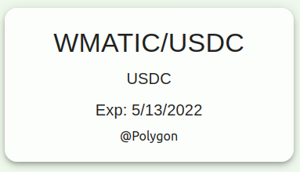
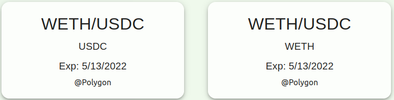

poption合约
================

在进行poption交易之前需要先选择合约。合适的合约能提供我们需要的金融服务。每一个poption智能合约都有三个重要属性，它们决定了poption是如何行权的，也和合约能提供的金融服务紧密相关。

Poption的属性
------------------------
Potpion智能中有三个重要属性，预言机、底层资产类型、到期时间。在poption在到期时，poption智能合约会从预言机中获取当前价格作为结算价格。在poption到期后，持有人可以行权，当他们行权时，智能合约会将结算价格代入持有者的收益曲线函数中，并将对应函数输出值的底层资产转入持有者账户中。在 `poption App <https://www.poption.exchange/app/>`_  我们可以看到一些poption智能合约。每个合约的第一行是它的预言机，第二行是它的底层资产，第三行则是到期时间。如下所示。

.. image:: ../images/apps.png
    :align: center

Poption 的收益函数
------------------
Poption的收益函数以ERC1155结余（balance）的形式储存在智能合约中。持有人可以在poption合约的操作界面中查看自己持有的payoff。如下图所示：

.. _bull-spread-exp:

.. figure:: ../images/balance.png
    :alt: balance
    :align: center

    一个账户中的牛市价差期权

Poption持有人也可以在Etherscan（Polygonscan）中查看相应的信息。更详细的方法可以在 :ref:`payoff_detail` 找到。

例子
----
一个poption合约的预言机是 MATIC/USDC ，它的底层资产是USDC，它的到期时间是5/13/2022 。一个投资者在这个poption中有 :math:`f(x) = 100 \cdot clamp(x - 0.9, 0, 0.6)` 的收益函数（见图 :ref:`bull-spread-exp` ）。那么当合约到期时，如果MATIC兑USDC的价格为1，他将得到10 USD，如果价格为1.5，他将得到60 USDC。关于更多这个 :ref:`leverage_example` 的解释 。

做多Matic
~~~~~~~~~

如果需要做多 MATIC，我们需要选择一个以MATIC价格为预言机的poption。比如说我们选择 MATIC/USDC 的价格为预言机，然后我们可以选择USDC作为底层资产。我们还要选择一个到期时间，这可以是任意的未来时间，在这里我们选择5/13/2022。确认一下这个合约是在合适的链上，在这个例子中，合约在polygon中。我们的资产也在这条链上，这是一个合适的选择。在 `poption App <https://www.poption.exchange/app/>`_ 中我们选择如图所示的合约并点击进入操作界面。后续操作可以参考  :ref:`leverage_example`  。

对冲无常损失
~~~~~~~~~~~~

如果需要对冲Uniswap等在现货市场做流动性提供者的无常损失，我们需要选择一个以该流动性池价格为预言机的poption。比如说去对冲在USDC-WETH池中产生的无常损失，我们选择 WETH/USDC 的价格为预言机，然后我们可以选择USDC/WETH作为底层资产。其余和上一个例子相同。在 `poption App <https://www.poption.exchange/app/>`_ 中我们选择如图所示的合约之一并点击进入操作界面。

Poption Contract is one of the key contract in Poption DEX. It plays the role of Erc20 tokens in spot DEX. There are mint, burn and transfer functions in the contract.
Poption comes from option, but its design is beyond option. By focusing more on payoff, poption has simpler, symmetric and more flexible structure than option. Poption is highly capital efficient and fully collateralized at the same time.
There is only one role in poption, the poption holder. The holder gets the return based on the payoff he/she holds in the contract. There is no writer any more, the position of the buyer or the seller is symmetric.
Basic attributes
Underlying asset
For each poption contract there is an underlying asset token. Poption is minted from the underlying asset, and the payoff is settled in the same token. Holders can also burn the poption to redeem the token.
Settlement Oracle
Settlement oracle can provide price information of the spot market to the poption. The information source can be a DEX on chain or another oracle providing off chain information. When poption settles, it will fetch the settle price from the oracle.
Expiration time
Poption holders can exercises the poption after the expiration time. The first exercise transaction or settle transaction taken after the expiration time will trigger the settlement process. The poption will get a price from settlement oracle and all the payoff will be settled in that price. Once the poption is settled. Holders can get the payoff back by taking the exercise transaction.
Payoff (slots and balance)
Payoff is a function whose input is the settle price and whose output is the amount of underlying asset the holder should receive when the poption expires. In the poption contract the payoff function is discretized by a connected series of line segments. The coordinates of the endpoints are stored in contract as slots and holder's balance. Slots and balance are vectors with the same length N. When the settle price is equal to one of the slots the payoff is equal to the corresponding balance.
