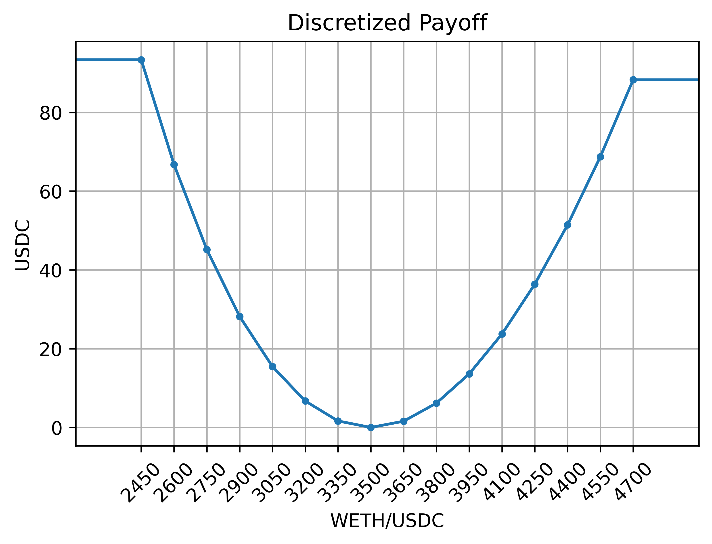

poption合约
================

在进行poption交易之前需要先选择合约。合适的合约能提供我们需要的金融服务，因此对合约有个全面了解对我们非常重要。

Poption的属性
------------------------
Potpion智能中有三个重要属性，预言机、底层资产类型、到期时间。在poption在到期时，poption智能合约会从预言机中获取当前价格作为结算价格。在poption到期后，持有人可以行权，当他们行权时，智能合约会将结算价格代入持有者的收益曲线函数中，并将对应函数输出值的底层资产转入持有者账户中。

Poption 的收益函数
------------------
Poption的收益函数代表着poption持有人在智能合约中所拥有的资产。它的输入是结算价格，它的输出是持有人在poption到期时应收到的标的资产数量。持有的收益函数越大，在到期时所能获得的资产越多。Poption的收益函数以ERC1155结余（balance）的形式储存在智能合约中。持有人可以在poption合约的操作界面中查看自己持有的payoff。如下图所示：

.. _bull-spread-exp:

.. figure:: ../images/balance.png
    :alt: balance
    :align: center

    一个账户中的牛市价差期权

Poption持有人也可以在Etherscan（Polygonscan）中查看相应的信息。更详细的方法可以在 :ref:`payoff_detail` 找到。

铸造/燃烧
----------------
任何人都可以通过将底层资产锁定到 popion 合约中来铸造 popion。 从 1 个单位的底层资产中可以铸造出收益始终为 1 的poption。 持有人也可以烧掉他恒定收益的poption，以赎回相同数量的底层资产。

.. _payoff_detail:

收益函数的具体实现
-------------------
通过了解poption智能合约中收益函数的具体实现能更进一步的了解poption的特性。在poption中我们使用分段线性函数来描述收益函数。具体函数如下：

.. math::
    f(x) = \begin{cases} balance_0 & x < slot_0 \\
    balance_{i} & x = slot_{i} \\
    balance_{N-1} & x \geq slot_{N-1} \\
    \dfrac{slot_{i+1} - x}{slot_{i+1} - slot_{i}}  balance_{i} + \dfrac{x - slot_{i}}{slot_{i+1} - slot_{i}}  balance_{i+1} & slot_{i} \leq x < slot_{i+1}  \end{cases}

其中 :math:`slot_i` 是关键点（分段线性函数中的线段端点）的价格，它被储存在合约的 ``slots`` 变量中。 :math:`balance_i` 是poption持有人在关键点价格上的收益，它以ERC1155的形式储存在合约中。可以通过 ``balanceOf`` 方法查询。在行权时，当结算价格为 :math:`slot_i` 的时候，持有人能得到 :math:`balance_i` 的底层资产。

在了解了收益函数的具体实现后我们也可以在Etherscan中查看代表收益函数的ERC1155 token。如 `https://polygonscan.com/token/<poption_address>?a=<holder_address> <https://polygonscan.com/token/0xD6Dcb2eE2D996620c8CC948f5425C223792eDF9d?a=0xfdd6a9c9201c36b6f9c9533a8859818dde6c9a72#inventory>`_ 。

一个例子
~~~~~~~~~~~~~~~~~~~~~~~~~~~~
以下是一个近似对冲无常损失的例子。
其中的slot是 ::

    [2450, 2600, 2750, 2900, 3050,
    3200, 3350, 3500, 3650, 3800,
    3950, 4100, 4250, 4400, 4550, 4700]

balance 是 ::

    [93.37981426, 66.7587484 , 45.163177  , 28.18707117, 15.47629892,
    6.71978773,  1.64253269,  0.        ,  1.57359974,  6.16698848,
    13.60302297, 23.72123005, 36.37568973, 51.43325186, 68.77202431, 88.28008373]

相应的曲线图像则是

移交
--------
Poption 收益作为一种ERC1155是可以被移交的。在移交的功能的基础上我们可以构建自动做市商。

前端界面
--------
合约列表
~~~~~~~~~
.. image:: ../images/apps.png
    :align: center

属性栏
~~~~~~~~~~~~~~
绿框中的是底层资产，括号中的数字是App连接的钱包中的底层资产数量。虚线框中的是poption相关合约地址。

红框中的是预言机，括号中的数字是当前预言机中的价格。虚线框中的是预言机相关合约地址。

蓝框中的是到期日期，虚线框中的是到期时间和一些其他和合约相关的时间。

.. image:: ../images/swap_1.png
    :align: center

收益函数相关
~~~~~~~~~~~~~~
在Swap功能页面中上部分有一个balance图表：

.. figure:: ../images/balance.png
    :alt: balance
    :align: center

在Swap功能页面最下方 Detail 栏中有一个查看每个插槽状态的地方：

.. figure:: ../images/balance_1.png
    :alt: balance
    :align: center
