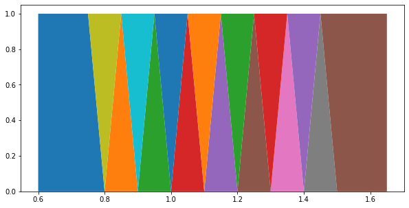
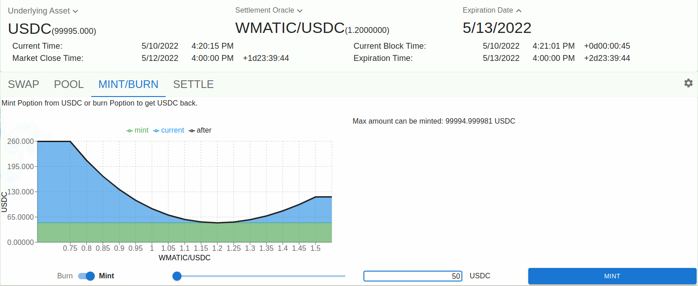
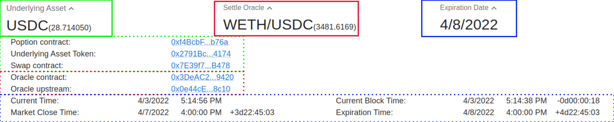
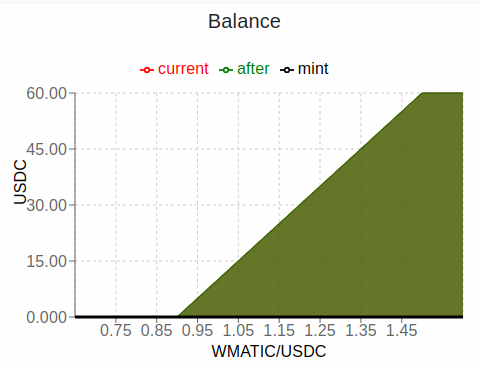
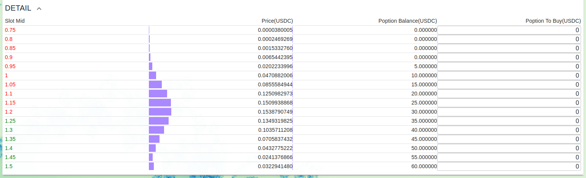

poption合约概述
================
在了解一些poption的应用场景之后我们可以回过头在来更进一步了解一下poption合约。

Poption的属性
------------------------
Potpion智能中有三个重要属性，预言机、底层资产类型、到期时间。在poption在到期时，poption智能合约会从预言机中获取当前价格作为结算价格。在poption到期后，持有人可以行权，当他们行权时，智能合约会将结算价格代入持有者的收益曲线函数中，并将对应函数输出值的底层资产转入持有者账户中。

.. _payoff_tokens:

收益函数和收益令牌
------------------
Poption的收益函数代表着poption持有人在智能合约中所拥有的资产。它的输入是结算价格，它的输出是持有人在poption到期时应收到的标的资产数量。持有的收益函数越大，在到期时所能获得的资产越多。在 poption 中所有的收益函数都会被看作是 2 个梯形和 N-2 个三角形的组合。

比如通过一个单位的底层资产铸造的常数收益会被切分成如下形状：

比如一个对冲无常损失的收益会被切分成如下形状：

.. image:: ../images/poption_token_split_il.png
    :align: center

这些三角形和梯形可以独立地代表不同的收益，以下是一系列单位高度的这些三角形和梯形的收益曲线：

.. image:: ../images/poption_token_unit.png
    :align: center

然后我们将这些独立的梯形和三角形视为令牌。我们的 poption 合约是一个 ERC1155 合约，它能将这些三角形和梯形的高以令牌的结余信息的形式储存在智能合约中。这样我们就可以将不同的收益函数转化成统一的便于定价和交易的令牌，我们把这些代表收益的令牌叫做收益令牌，一个Poption合约中会有N个不同的收益令牌，N是一个常数，当前大多数的 poption 合约的 N 为 16。收益和收益令牌结余  :math:`balance_i` 的关系以如下方式严格定义。在该定义下，在行权时，当结算价格为 :math:`slot_i` 的时候，持有人总能得到 :math:`balance_i` 的底层资产：

.. math::
    f(x) = \begin{cases} balance_0 & x < slot_0 \\
    balance_{i} & x = slot_{i} \\
    balance_{N-1} & x \geq slot_{N-1} \\
    \dfrac{slot_{i+1} - x}{slot_{i+1} - slot_{i}}  balance_{i} + \dfrac{x - slot_{i}}{slot_{i+1} - slot_{i}}  balance_{i+1} & slot_{i} \leq x < slot_{i+1}  \end{cases}

其中 :math:`slot_i` 是梯形和三角形顶点的x坐标（价格），它被储存在合约的 ``slots`` 变量中，且一旦初始化就无法被改变的。

我们可以在Etherscan中查看在poption中持有的收益令牌结余。如 `https://polygonscan.com/token/<poption_address>?a=<holder_address> <https://polygonscan.com/token/0xD6Dcb2eE2D996620c8CC948f5425C223792eDF9d?a=0xfdd6a9c9201c36b6f9c9533a8859818dde6c9a72#inventory>`_ 。

铸造/销毁
----------------
任何人都可以通过将底层资产锁定到 popion 合约中来铸造 popion。 从 1 个单位的底层资产中可以铸造出收益始终为 1 的 poption，也就是会铸造所有的收益令牌各 1 个。 持有人也可以销毁他恒定收益的 poption，以赎回相同数量的底层资产。在 poption app 中在 poption 的 Mint/Burn 标签页中可以找到相关的功能界面。如下图所示：

移交
--------
收益令牌作为一种ERC1155是可以被移交的。在移交的功能的基础上我们可以构建自动做市商。

行权
--------
因为poption是按上述方式铸造和转移的。所以它是完全抵押的。行权收益的总和始终等于合约中锁定的代币总量。所有持有人的收益均保证能在任何情况下获得。

前端界面
--------
合约列表
~~~~~~~~~
.. image:: ../images/apps.png
    :align: center

属性栏
~~~~~~~~~~~~~~
绿框中的是底层资产，括号中的数字是App连接的钱包中的底层资产数量。虚线框中的是poption相关合约地址。

红框中的是预言机，括号中的数字是当前预言机中的价格。虚线框中的是预言机相关合约地址。

蓝框中的是到期日期，虚线框中的是到期时间和一些其他和合约相关的时间。

收益函数相关
~~~~~~~~~~~~~~
在Swap功能页面中上部分有一个balance图表，它代表了用户持有的收益曲线：

在Swap功能页面最下方 Detail 栏中可以查看每个收益令牌的详细信息：

