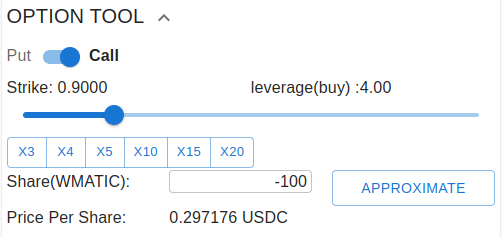
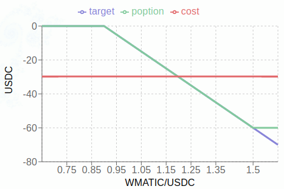
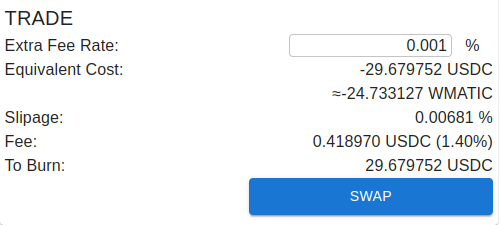
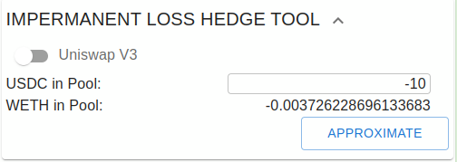
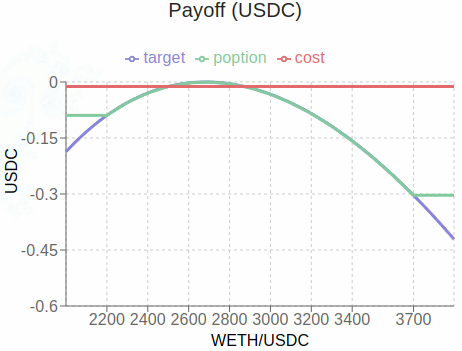
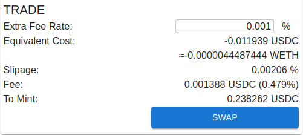
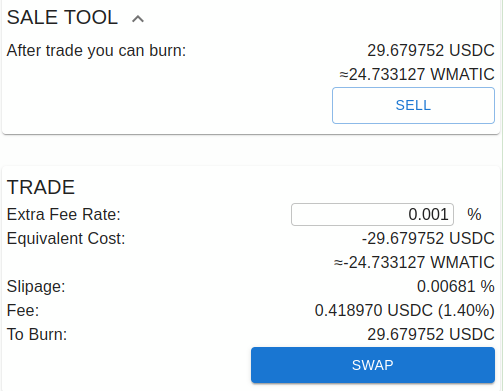

卖出/沽空poption
========================

在poption中，对于任意一个可以买入的收益曲线我们都可以卖出/沽空它。如果我们拥有一个poption，我们可以卖出它并直接获得底层资产。如果我们沽空一个poption，我们则需要质押一些底层资产。

沽空一个看涨期权
--------------------
在期权小工具的设置中将share设为负数就能沽空相应期权：

下图是对应的收益函数，因为我们是在沽空，因此收益函数也在负区间，此时的cost也是负数，实质表示的是我们卖出poption收益曲线并买入底层资产：

在结算信息中，我们也能看到在这里等价成本变为了负数，当我们拥有此资产时，完成交易后我们能获得相应的回报。如果我们没有相应的资产，我们放入一定的底层资产去实现裸卖空，值得注意的是在poption中裸卖空采用的是和买多一样的机制，因此也同样没有清算风险。详见 :ref:`trade_tool` ：

沽空一个无常损失
----------------------
我们在无常损失工具中输入负数就可以沽空无常损失。具体可以参考下图例子中的方法：

卖出所有持有的poption
-----------------------
在 SALE 工具中点击 SELL 我们可以生成一个卖出所有所持有的poption收益曲线的交易。如下图所示：

讨论
----------------
我们可以看到在poption中沽空一个衍生品非常的方便，这有助与市场价格机制充分发挥作用，及时准确传递市场信号，满足各种金融需求。此外在poption中沽空也是安全的，无清算风险的。
