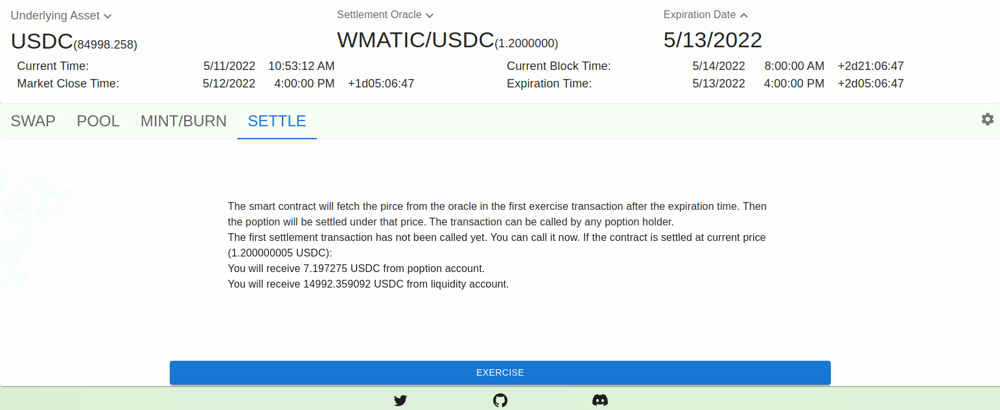

行权/结算
===============

当poption到期后，我们可以结算界面进行结算。对于普通poption持有者来说，结算poption会直接销毁poption中最终命中结算价格的收益令牌，并将对应的收益转给poption持有者。对于同时持有poption
收益令牌和poption 流动性令牌的用户来说。poption会先撤出投资者流动性池中的poption，销毁流动性令牌并转化收益令牌。之后再像普通poption持有这那样结算poption收益。操作界面如下所示：

(这里的时间有些奇怪是因为使用了测试环境。)
